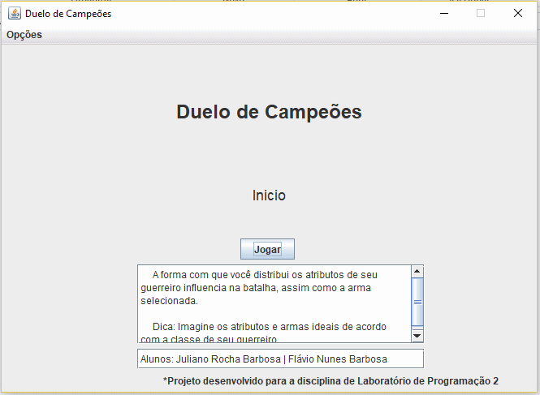

# DueloDeCampeoes

A college work done for Programming Lab discipline, all project is in portuguease language. Created by me and my friend Flavio Nunes Barbosa.

<h3>The attributes like damage and critical hit chance of each class is calculated based on their main attribute values and weapon equipped:</h3>

<b>Critical hit chance</b>: 0.3\*intelligence 
<b>Chance to dodge</b>: 0.3\*agility 
<b>Armor</b>: strength/4 

<h4>Attack values:</h4>

Elf: 0.3*agility + 0.1*intelligence + 0.1*strength 
Favorite weapon: Light weapon (Bow) 

Wizard: 0.1*agility + 0.3*intelligence + 0.1*strength 
Favorite weapon: Magic weapon (Staff)

Orc: 0.1*agility + 0.1*intelligence + 0.3*strength 
Favorite weapon: Heavy weapon (Club)

